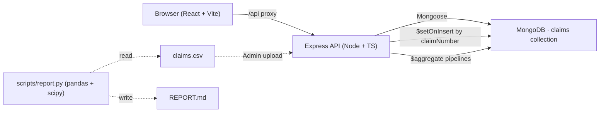

# WTY · Warranty Telehandler Yard

A local-only, dark-themed full-stack web application for interrogating JCB **LDL telehandler** warranty claim data.
Black UI, JCB-yellow navigation, React + Node + MongoDB.

> Companion deliverables:
> - [`REPORT.md`](./REPORT.md) — long-form executive analysis, technical appendix and one-page Action Dashboard generated from the same dataset.
> - [`docs/manual/`](./docs/manual/) — 9-section end-user operation manual (also served in-app at `/manual`).
> - [`docs/pages/`](./docs/pages/) — 11 per-tab technical reference docs.
> - [`docs/IMPROVEMENTS.md`](./docs/IMPROVEMENTS.md) — prioritised roadmap of every enhancement on the table.
> - [`docs/AI-FREE-OPERATION.md`](./docs/AI-FREE-OPERATION.md) — air-gapped deployment evidence.

---

## Table of contents

1. [What this is](#1-what-this-is)
2. [Feature tour](#2-feature-tour)
3. [Architecture](#3-architecture)
4. [Data model](#4-data-model)
5. [Business rules baked in](#5-business-rules-baked-in)
6. [Local setup](#6-local-setup)
7. [Running the app](#7-running-the-app)
8. [Daily operation](#8-daily-operation)
9. [API reference](#9-api-reference)
10. [Folder layout](#10-folder-layout)
11. [Performance notes](#11-performance-notes)
12. [Limitations](#12-limitations)
13. [Roadmap & improvements](#13-roadmap--improvements)

---

## 1. What this is

A standalone analytics workbench for the JCB Loadall (LDL) warranty team. It replaces ad-hoc spreadsheets with:

- A **single source of truth** in MongoDB keyed on `claimNumber`, so the same CSV can be re-uploaded daily without creating duplicates.
- A **live dashboard** with 8 analytical tabs covering volume, build-date batch issues, vetting regime change, outcome drivers, description NLP, supply-chain, reliability and data-quality.
- A **machine-generated long-form report** (`REPORT.md`) with the same numbers and a prioritised action plan.

Everything runs on one workstation; no cloud, no internet access required after install. The CSV format is fixed (25 columns, as supplied), and the ingest pipeline is idempotent.

## 2. Feature tour

### Navigation bar
Black bar with a JCB-yellow bottom border. Left: "WTY" logo + subtitle ("LDL Division · Claims Intelligence"). Right: three links — **Dashboard**, **Report** and **Admin** — each with an active-state yellow underline.

### Landing — Dashboard
Hero strip with an animated headline ("Warranty intelligence · LDL telehandler claims"), 8 KPI tiles with count-up animation, two sticky bars, then a 11-tab strip.

**KPI tiles** (left → right):
- Total claims
- True Accept Rate (`Accept / Vetted`, Z-Code excluded)
- Reject Rate
- Z-Code Rate (goodwill payments)
- DOA Rate
- Pending vets
- Avg hours-to-fail
- Active models

**Sticky top strip** (always visible):
- Date range picker (from / to) — calendar inputs
- Quick-pick chips: `All · Last 30d · Last 90d · YTD · 2024 · 2025 · Pre-regime · Post-regime`
- `Presets` (save/recall named filter sets via localStorage)
- `Export CSV` (streams the current filter to a downloadable CSV)
- `Recompute` (re-derive NLP / regime / hours-bucket fields on every existing doc — rare maintenance action)

**Sticky filter bar** (below the top strip): multi-select chips for Model, Country, Supplier, Area, tPeriod, Outcome, Regime, Vetter, Tag, Dealer, Theme, plus a description text-search box and a reset button. All state is URL-synced (you can share a link with the exact filter applied).

**Claim detail modal**: clicking any claim row anywhere — DQ grid, NLP search results, theme-integrity samples, drill-down lists — opens a right-side drawer with every field, all NLP tags, the full description (with a truncation warning if it hits the 600-char cap), the vetter notes, and a panel listing every other claim against the same serial.

**Self-documenting widgets** (improvement pass):
- **Every chart card** has an `(i)` icon next to its title. Hovering shows a 1-2 sentence plain-English explanation, the computational formula (e.g. `count(Accept)/count(*)`), and which raw fields it draws from. A small chip on the top-right shows the date window in scope (e.g. `2025-01-01 → today`, `pre Jan-2025`, or `all data`).
- **Every KPI tile** has an `(i)` icon next to its label with the same info + formula. The bottom of each tile shows `range: 2025-01-01 → 2025-10-31` so you always know what window the metric covers.
- **Every Recharts chart** has a `<Legend>` strip so series colours are explicit.

**Tab 1 — Overview**
Claims-over-time stacked area (vetted vs built), Pareto of failure areas, claims-by-model bar with DOA-rate overlay, top-25 failed-parts table with accept-rate badge. Area and Model bars are click-to-filter; supplier names in the parts table are click-to-filter.

**Tab 2 — Build-date trends**
Build-cohort claim volume + DOA rate (with a "mature cohorts only" toggle that defaults on, hiding recent cohorts whose tail T-periods haven't materialised yet), build-month × area heatmap (click a column header to drill in), per-cohort drill table showing top parts, areas, tags, dealers, countries.

**Tab 3 — Vetting & regime**
Pre vs post Jan-2025 KPI delta table (with pp change), monthly outcome stacked bar with the regime reference line, sortable vetter scorecard (Reject / Z-Code / median days-to-vet / first→last / **Accept rate last**), per-vetter accept-rate trend lines (click vetters in the scorecard to add/remove).

**Tab 4 — Outcome drivers**
Pick a dimension (Area, Theme, Model, Supplier, tPeriod, Hours bucket, Country, Dealer, Detection, Description tag) → returns the values most likely to be rejected, accepted, or z-coded (with `$setWindowFields` deviation vs baseline). Bottom chart: outcome mix for the top 15 values.

**Tab 5 — Description NLP**
Description-truncation banner (showing how many rows hit the 600-char source cap and may be partial), tag cloud (click tags to add to trend), tag frequency bar chart, top unigram / bigram tables, tag co-occurrence pair table, vetter-notes top-token miner, multi-line tag-trend chart, free-text search using a Mongo text index over the description column (row click → modal).

**Tab 6 — Supply & geography**
Supplier outcome stack, supplier reject-rate league (Accept rate last), country claim volumes.

**Tab 7 — Reliability**
Hours-to-fail histogram, tPeriod mix per model (100 % stacked), DOA league table (Reject / Z-Code / **Accept last**).

**Tab 8 — Operations** *(new in improvement pass)*
- PDI / UV escape rate KPI + top 25 escape parts (the issues that **should have been caught at PDI**).
- `Cannot Detect` share over time, with the Jan-2025 regime line (validates the post-regime jump from < 1 % → 20 %+).
- Time-to-vet monthly average + per-vetter average days.
- ASD ownership split (Assembly / Supplier Internal+External / Design) with outcome rates.
- Z-Code drivers (top parts + top areas where the goodwill payments concentrate).
- Day-of-week + month-of-year seasonality bar charts.
- Theme integrity audit — rows where `theme` has been used as an outcome value (data quality issue, 120+ rows).

**Tab 9 — People & places** *(new in improvement pass)*
- 4 KPI stats: total unique serials, ≥2 / ≥5 / ≥10 claim repeat-offender counts.
- Repeat-offender machines table (≥5 claims): serial, model, dealer, country, build/vet dates, outcome counts. Serial click → modal opens the latest claim on that serial.
- Dealer scorecard (top 50): claims, country count, Reject / Z-Code / Accept rates. Dealer click → filter.
- Customer scorecard (top 40, excluding stock).
- Country reject-rate league (n ≥ 200) sorted ascending by accept rate.

**Tab 10 — Data quality & drill-down**
Anomaly tiles (negative build→fail days, missing dates, unvetted backlog, unknown area/theme, null hours, description-truncated rows, theme-mislabelled rows). Server-paginated claims grid with all fields — row click opens the claim modal.

**Tab 11 — Full report** *(new in improvement pass)*
Renders `REPORT.md` inline (server-served at `/api/report`) with JCB-themed markdown styling. Includes `Download .md` and `Print / Save PDF` actions (the latter uses the browser print dialog with print-friendly CSS that switches to a light theme for paper).

### Report page (`/report`) — **PDF generator** *(new pass)*
Linked from the navbar. Two-step flow:

1. **Pick a date window** (calendar inputs `From / To`, or one of the quick-pick chips `All · Last 30d · 90d · YTD · 2024 · 2025 · Pre-regime · Post-regime`). The picker shows the actual data-window the dataset covers as a hint.
2. **Generate report** → renders a long single-page report with every section you'd want in a PDF deliverable, all filtered to the selected `vettedDate` window. Sections, in order:
   - §1 Headline KPIs (total / accept / reject / z-code / DOA / pending / avg hours / active models)
   - §2 Auto-generated headlines (regime impact, top part, worst-DOA family, recidivism, PDI escape, dominant symptom — only those with a real signal)
   - §3 Temporal trends — monthly volume + year-on-year clustered bars
   - §4 Vetting regime impact — pre vs post Jan-2025 table + monthly outcome stack
   - §5 Pareto & root-cause — failure-area Pareto, model league + DOA line, top 25 parts table
   - §6 Build-date cohort — DOA-by-build-cohort area chart
   - §7 Operations — PDI escape, Cannot-Detect trend, ASD split, day-of-week + month-of-year seasonality
   - §8 Vetter scorecard (with Accept last)
   - §9 People & Places — repeat-offender machines, dealers, customers, countries
   - §10 Supply chain — top 20 suppliers
   - §11 NLP — top symptom tags + top bigrams
   - §12 Data quality — anomaly tiles
3. **Print / Save as PDF** button (also `Ctrl+P`) — triggers the browser print dialog. Print CSS hides the nav, footer, sticky action bar, and recharts tooltips; switches the body to a white background, dark text, light table styles, JCB-yellow accents kept; uses `break-inside-avoid` on every section to prevent ugly mid-section page breaks; page size A4 with 10-14 mm margins.

A loading badge in the sticky action bar shows progress (`loading 14/25…`) as all 25 endpoints stream their data; the Print button is disabled until everything is ready so you never PDF-export a half-loaded report.

### Admin
Drag-and-drop CSV zone, progress bar, result card (received / inserted / skipped duplicates / parse errors / duration), and a 20-row upload history with status badges.

## 3. Architecture



- **Frontend**: Vite dev server on `:5173` proxies `/api/**` to the backend.
- **Backend**: Express on `:4000` with Mongoose. All analytics endpoints are single Mongo `$aggregate` pipelines (no in-memory crunching).
- **Database**: MongoDB on `:27017`, database `wty`, collection `claims`. `claimNumber` is the natural `_id`.
- **Report**: standalone Python script that reads the raw CSV (not the database) so it stays runnable even with the API down.

## 4. Data model

### Source columns (verbatim from the LDL export)

| # | Column | Meaning |
|---|---|---|
| A | `_id` | Mongo ObjectId from the upstream export; not used as our key |
| B | `area` | Production-system area assigned by the vetter |
| C | `asd` | Department: Assembly / Supplier External / Supplier Internal / Design |
| D | `Machine Model` | Family-level model number |
| E | `buildDate` | Date the machine was built (batch analysis key) |
| F | `claimDate` | Date the claim was submitted |
| G | `claimNumber` | **Unique** claim number — used as Mongo `_id` |
| H | `serial` | Machine serial number |
| I | `country` | Country the machine is/was destined for |
| J | `customer` | End customer (`#` = stock / no customer assigned) |
| K | `dealer` | Selling / claiming dealer |
| L | `description` | Free-text claim narrative |
| M | `detection` | Where the issue should have been caught in production |
| N | `division` | Business unit (always `LDL`) |
| O | `failDate` | Date the issue occurred |
| P | `failedPart` | Failed part number + description |
| Q | `theme` | Fault theme |
| R | `hours` | Machine operating hours |
| S | `model` | Detailed model variant |
| T | `Vetters notes` | Internal vetting notes |
| U | `Claim Outcome` | Vetter decision |
| V | `tPeriod` | Warranty bucket (DOA / T000–T006) |
| W | `vettedBy` | Vetter name |
| X | `vetted_date` | Date claim was vetted |
| Y | `partSupplier` | Supplier of the failed part (where applicable) |

### Derived fields (created during ingest)

| Field | How it's derived | Why |
|---|---|---|
| `failedPartCode` | `failedPart.split('-')[0].trim()` | Clean Pareto grouping |
| `hoursBucket` | `0-50 / 50-250 / 250-1000 / 1000-5000 / 5000+` | Bucketing for chi-square / drivers |
| `buildToFailDays` | `failDate − buildDate` (days) | Reliability proxy & anomaly detection |
| `descriptionTokens` | lowercased, stop-words removed, length ≥ 3 | NLP n-gram queries |
| `descriptionBigrams` | adjacent token pairs | NLP bigram analysis |
| `descriptionTags` | controlled-vocab tagger (40+ symptom tags) | Tag cloud / tag trend / filter |
| `regime` | `pre-2025` / `post-2025` / `unvetted` (vs `2025-01-01`) | Vetting regime change analysis |
| `ingestedAt` | timestamp at insert | Audit trail |

### Indexes

`machineModel`, `tPeriod`, `area`, `vettedDate`, `buildDate`, `failedPartCode`, `partSupplier`, `country`, `dealer`, `(vettedBy, vettedDate)`, `claimOutcome`, `regime`, multikey on `descriptionTags`, and a **text index** on `description` for the free-text search.

### Schema cleaning rules

- Trim trailing space on `hours ` → `hours`.
- Parse all 4 dates from `DD/MM/YYYY` → UTC `Date`.
- `hours = '#'` → `null`; `hours > 20000` or `< 0` → `null` (likely data-entry errors).
- `area / asd / detection / theme` nulls → `"Unknown"` so they survive groupings.
- `claimOutcome` empty → `null` (counts toward the `pending` KPI).

## 5. Business rules baked in

| Rule | Why it matters | Where it's enforced |
|---|---|---|
| `_id = claimNumber` | Re-uploading the same CSV is a no-op — every `bulkWrite` uses `$setOnInsert` keyed on `claimNumber`, so existing rows are never overwritten and new ones are inserted. | `backend/src/services/ingest.ts` |
| **True Accept Rate = Accept ÷ Vetted** | Z-Code is a goodwill payment, **not** an accept. Per the vetting team's definition. | `backend/src/routes/analytics.ts` (`ACCEPT_DENOM`, `IS_ACCEPT`) |
| Jan-2025 regime split | A new vetting manager took over in Jan 2025 and changed the team's bias significantly. Every monthly chart shows a JCB-yellow reference line at 2025-01-01 and there's a dedicated **Vetting & regime** tab. | `backend/src/utils/dates.ts` (`REGIME_DATE`), `frontend/src/components/charts/RegimeLine.tsx` |
| Z-Code, Reject, More Info, Parts Back, Pictures Required, **Raise on Supplier** all count as denominators only | KPI honesty. `Raise on Supplier` only appeared post-regime, so we recognise it explicitly. | `backend/src/routes/analytics.ts` |

## 6. Local setup

### Prerequisites

- **Node** ≥ 20 (`node --version`)
- **MongoDB Community** 7 or 8 installed locally
- **Python** ≥ 3.10 with `pandas`, `numpy`, `scipy` (only for regenerating `REPORT.md`)

### Install

```bash
# 1. clone / open the wty/ folder
cd wty

# 2. backend
cd backend && npm install

# 3. frontend
cd ../frontend && npm install
```

## 7. Running the app

### Easiest — double-click a batch file

| File | What it does | When to use |
|---|---|---|
| **`start-dev.bat`** | Spins up MongoDB, the backend in **tsx watch** mode (live reload), and the Vite dev server (HMR). Pre-cleans any stale `:4000` / `:5173` listener, waits for Mongo / backend / Vite, then runs a **7-endpoint verification table** that asserts `mode == "development"` + the Vite proxy is wired. Opens 3 cmd windows + your browser at `http://localhost:5173/`. Safe to re-run; never produces a double launch. | Day-to-day editing / debugging |
| **`start-prod.bat`** | Builds the frontend (`vite build`) and backend (`tsc`), then starts MongoDB and a single Node server on `:4000` that serves **both** the API and the built frontend. Prints node/npm versions, bundle sizes, waits for `/api/health`, and then runs a **7-endpoint verification table** that asserts `mode == "production"` before opening the browser. Aborts the launch if any check is red. Pass `--rebuild` (or `-r`) to force a fresh build. Pre-cleans stale `:4000` listeners. | Demo / "production" / share with non-devs |
| **`stop.bat`** | Three-pass cleanup: by window title, by listening port (`:4000` / `:5173`), and by stray `tsx.exe` watcher. Probes with `tasklist` first so the report accurately distinguishes `[stop]` from `[skip]`. Leaves the Windows MongoDB service alone. | When you're done |

The batch files are idempotent: they check for `node_modules` and run `npm install` on first use, they check `netstat` so they won't start a second MongoDB on `:27017` if one's already there, and they wait for the server to respond before opening the browser.

### Dev mode flow (what `start-dev.bat` runs)

1. Locate `mongod.exe` (8.0 → 7.0 → PATH) and create `mongo-data/` if missing.
2. `npm install` in `backend/` and `frontend/` if `node_modules` is absent.
3. Open **WTY :: MongoDB** window:
   ```
   "C:\Program Files\MongoDB\Server\8.0\bin\mongod.exe" --dbpath "<wty>\mongo-data" --bind_ip 127.0.0.1 --port 27017
   ```
4. Open **WTY :: Backend (dev)** window: `npm run dev` (tsx watch src/index.ts) → `:4000`.
5. Open **WTY :: Frontend (dev)** window: `npm run dev` (Vite) → `:5173`, proxying `/api` to `:4000`.
6. Poll `http://localhost:5173/` until 200 → open browser.

### Production mode flow (what `start-prod.bat` runs)

1. Same sanity checks as dev.
2. `cd frontend && npm run build` → produces `frontend/dist/`.
3. `cd backend && npm run build` → produces `backend/dist/`.
4. Start MongoDB the same way as dev.
5. Open **WTY :: Server (prod)** window:
   ```
   cd backend & set NODE_ENV=production & node dist/index.js
   ```
   The backend (`src/index.ts`) auto-detects `frontend/dist/` next to it, mounts it under `express.static` with `Cache-Control: public, max-age=3600 + ETag`, and adds an **SPA fallback** so `/`, `/admin`, `/report` (and any other React Router route) all serve `index.html` — while `/api/*` continues to serve JSON.
6. Poll `http://localhost:4000/api/health` until 200 → open browser at `http://localhost:4000/`.

### Manually (no batch files)

```bash
# DEV — three terminals
"C:/Program Files/MongoDB/Server/8.0/bin/mongod.exe" --dbpath "<wty>/mongo-data" --bind_ip 127.0.0.1 --port 27017
cd backend  && npm run dev
cd frontend && npm run dev
# open http://localhost:5173/

# PRODUCTION — two terminals
cd frontend && npm run build
cd ../backend && npm run build
"C:/Program Files/MongoDB/Server/8.0/bin/mongod.exe" --dbpath "<wty>/mongo-data" --bind_ip 127.0.0.1 --port 27017
cd backend && set NODE_ENV=production && node dist/index.js
# open http://localhost:4000/
```

Expected production server logs:
```
[wty] Mongo connected: mongodb://localhost:27017/wty
[wty] API listening on http://localhost:4000
[wty] Serving frontend from <wty>\frontend\dist
[wty] Open http://localhost:4000/ in your browser
```

### Verified production build

A clean `start-prod.bat` cycle on the reference machine produced:
- Frontend bundle: `~33 KB CSS + 1.11 MB JS (321 KB gzipped)`, built in ~21 s.
- Backend `tsc` output: ~6 s.
- Cold start of the Node server: < 2 s before the first request.
- SPA fallback verified: `/`, `/report`, `/admin`, and any unknown deep path all serve `index.html` with HTTP 200.
- Re-ingesting the reference CSV against the prod server: 24,367 / 24,367 inserted, 0 parse errors, 11 s.

## 8. Daily operation

### Ingesting today's CSV

1. Click **Admin** in the nav bar.
2. Drag your `claims.csv` onto the drop zone (max 200 MB) and click **Ingest CSV**.
3. The pipeline runs:
   - Stream-parses with `csv-parse` (quote-relaxed, BOM-tolerant).
   - Cleans dates (`DD/MM/YYYY` → `Date`), hours (`#` → `null`, outliers clipped), normalises categorical fields.
   - Derives the NLP fields (tokens, bigrams, controlled-vocab tags) and the `regime` flag.
   - Builds a `bulkWrite` of `updateOne({_id: claimNumber}, {$setOnInsert: doc}, {upsert: true})` in batches of 1 000.
4. The result card shows `received / inserted / skippedDuplicates / parseErrors / duration`.
5. The upload is recorded in the `uploads` collection and surfaces in the history table.

The reference `claims.csv` (24,367 rows) ingests in ~11 s with zero parse errors. A second upload of the same file inserts 0 and skips 24,367.

### Filtering & drill-down

- The filter bar is URL-synced — copy-paste the URL to share a view.
- Every chart and table reacts to the global filter.
- Build-Date Trends tab: click a build-month column header in the heatmap to drill into that cohort.
- Vetting & Regime tab: click vetter rows in the scorecard to add them to the per-vetter trend chart.
- NLP tab: click tags in the cloud to add them to the tag-trend chart.
- Data Quality tab: server-paginated grid with all 25 columns visible.

### Regenerating the report

```bash
python scripts/report.py \
  "C:/Users/Vince/Downloads/claims.csv" \
  "C:/Users/Vince/OneDrive/Desktop/wty/REPORT.md"
```

## 9. API reference

All read endpoints accept the global filter bar query params:
`model, country, supplier, area, tPeriod, outcome, regime, vetter, dealer, theme, hoursBucket, tags, from, to, dateField, q`.
Arrays are comma-separated (`?model=540V140,532X60AG`).

### Health & meta

| Method | Path | Notes |
|---|---|---|
| `GET` | `/api/health` | `{ok: true, ts}` |
| `GET` | `/api/meta` | distinct lists for every filter, plus the tag vocabulary and global date range |
| `GET` | `/api/report` | raw `REPORT.md` (text/markdown) for the in-app viewer |
| `GET` | `/api/analytics/yoy` | `{year, month, n, accept, reject, zcode}` — used by the Overview year-on-year chart |
| `GET` | `/api/analytics/headlines` | auto-generated narrative cards (regime, top part, worst-DOA, recidivism, PDI escape, dominant tag, Cannot-Detect surge) |
| `GET` | `/api/analytics/recent-activity?limit=15` | most-recent vetted claims for the live activity feed |
| `GET` | `/api/analytics/tag-sparklines?topN=8` | monthly point series + momentum % per top tag |
| `GET` | `/api/analytics/movers?dim=area\|tag\|model\|supplier&periodDays=90` | top shifters between two equal periods, anchored to the latest vetted date in the data |

### Ingest

| Method | Path | Notes |
|---|---|---|
| `POST` | `/api/upload` | multipart `file=@claims.csv`. Returns `{received, inserted, skippedDuplicates, parseErrors, errorSamples[], durationMs}` |
| `GET` | `/api/upload/history` | last 20 ingests |

### Claims grid

| Method | Path | Notes |
|---|---|---|
| `GET` | `/api/claims?page&pageSize&sort&order&q&serial&excludeClaim&…` | server-paginated grid (`q` uses text index, `serial` returns claims for one machine) |
| `GET` | `/api/claims/:claimNumber` | single claim by number (used by the claim detail modal) |

### Export & admin

| Method | Path | Notes |
|---|---|---|
| `GET` | `/api/export/csv?…` | streams a CSV of the current filter (all 25 source columns + derived) |
| `POST` | `/api/admin/recompute` | walks every claim and re-derives `descriptionTokens / Bigrams / Tags`, `regime`, `hoursBucket` |

### Analytics — core

| Path | Returns | Notes |
|---|---|---|
| `/api/analytics/kpis` | totals, True Accept Rate, Reject Rate, Z-Code Rate, DOA, etc. | filtered |
| `/api/analytics/trend?by=month\|quarter` | claims per period (vetted vs built) + regime date |
| `/api/analytics/by-model` | claims, DOA rate, accept/reject/z-code rate per model |
| `/api/analytics/by-area` | Pareto with cumulative % via `$setWindowFields` |
| `/api/analytics/top-parts?limit=25` | top failed parts + supplier + accept rate |
| `/api/analytics/by-supplier?limit=20` | claims + outcome mix per supplier |
| `/api/analytics/by-country` | claims + accept rate per country |
| `/api/analytics/build-cohort` | claims per build-month + DOA + accept rate |
| `/api/analytics/build-area-heat` | flat list of `{ym, area, n}` cells |
| `/api/analytics/cohort-drill?ym=YYYY-MM-01` | top parts/areas/tags/dealers/countries for one build month |
| `/api/analytics/hours-distribution` | `$bucket` histogram |
| `/api/analytics/tperiod-mix` | DOA/T000–T006 mix per model |
| `/api/analytics/regime-impact` | pre vs post Jan-2025 outcome mix with pp delta |
| `/api/analytics/outcome-monthly` | monthly stacked outcome counts |
| `/api/analytics/vetter-scorecard` | per vetter: n, accept/reject/z-code rate, avg days to vet, first/last seen |
| `/api/analytics/vetter-monthly?vetters[]` | per-vetter per-month accept/reject/z-code rates |
| `/api/analytics/outcome-drivers?dimension=area\|theme\|model\|supplier\|tPeriod\|hoursBucket\|country\|dealer\|detection\|tag&minN=30` | for each value: counts, accept/reject/z-code rate, and `$setWindowFields` deviation vs baseline |
| `/api/analytics/description-tags` | tag frequency + accept/reject rate |
| `/api/analytics/description-ngrams?n=1\|2&limit=50` | top tokens / bigrams |
| `/api/analytics/description-trend?tags=oil-leak,loose` | monthly volume per chosen tag |
| `/api/analytics/description-search?q=boom+shimming` | text-indexed search with `$meta:textScore` |
| `/api/analytics/anomalies` | data-quality counters (now incl. `descTruncated`, `themeAsOutcome`) |

### Analytics — Operations / People & Places (improvement pass)

| Path | Returns | Notes |
|---|---|---|
| `/api/analytics/serial-recidivism?minClaims=5&limit=50` | repeat-offender machines + summary (`totalSerials`, `repeat2/5/10`) |
| `/api/analytics/pdi-escape` | total + escaped + escape-rate + top 25 escape parts |
| `/api/analytics/cannot-detect-trend` | monthly `Cannot Detect` count + share |
| `/api/analytics/seasonality` | day-of-week + month-of-year counts |
| `/api/analytics/time-to-vet` | monthly avg days-to-vet + per-vetter avg |
| `/api/analytics/by-asd` | Assembly / Supplier Int+Ext / Design split with outcome rates |
| `/api/analytics/by-dealer?limit=50` | dealer scorecard incl. country count |
| `/api/analytics/by-customer?limit=40` | customer scorecard (excludes stock `#`) |
| `/api/analytics/zcode-drivers` | top parts / areas / themes / suppliers / models for Z Code |
| `/api/analytics/theme-integrity` | count + samples of rows where `theme` is an outcome value |
| `/api/analytics/tag-cooccurrence?topN=15` | tag pair co-occurrence counts |
| `/api/analytics/by-vettersnotes` | top n-grams in `Vetters notes` (samples up to 8 k recent docs) |

## 10. Folder layout

```
wty/
├─ README.md                      # this file
├─ REPORT.md                      # generated analytical report
├─ start-dev.bat                  # boots Mongo + backend (watch) + frontend (Vite) → :5173
├─ start-prod.bat                 # builds, then boots Mongo + Node server on :4000 (serves both)
├─ stop.bat                       # three-pass cleanup (title / port / tsx watcher) - safe to re-run
├─ archives/                      # weekly.bat archives (REPORT-YYYY-MM-DD.md + .log, last 26 weeks)
├─ .gitignore
├─ mongo-data/                    # local mongod dbpath (created on first run)
├─ scripts/
│   └─ report.py                  # standalone REPORT.md regenerator (no DB dep)
├─ backend/
│   ├─ package.json
│   ├─ tsconfig.json
│   ├─ .env                       # PORT, MONGO_URI, MONGO_DB
│   └─ src/
│       ├─ index.ts               # express bootstrap (incl. GET /api/report)
│       ├─ db.ts                  # mongoose connect
│       ├─ models/Claim.ts        # schema + indexes + UploadLog
│       ├─ utils/dates.ts         # date parsing, regime/hours bucket helpers
│       ├─ services/
│       │   ├─ ingest.ts          # CSV stream + bulkWrite $setOnInsert
│       │   ├─ nlp.ts             # tokeniser + tag dictionary
│       │   └─ filters.ts         # buildMatch() shared by all routes
│       └─ routes/
│           ├─ upload.ts
│           ├─ claims.ts          # paginated grid + single by claimNumber + by-serial
│           ├─ meta.ts
│           ├─ analytics.ts       # 30+ aggregation endpoints
│           ├─ export.ts          # streaming CSV export
│           └─ admin.ts           # POST /api/admin/recompute
└─ frontend/
    ├─ package.json
    ├─ tsconfig.json
    ├─ vite.config.ts             # /api proxy → :4000
    ├─ tailwind.config.ts         # JCB palette tokens
    ├─ postcss.config.js
    ├─ index.html
    ├─ public/favicon.svg
    └─ src/
        ├─ main.tsx               # router + query client + sonner toaster
        ├─ App.tsx                # routes shell + footer
        ├─ index.css              # tailwind + dark tokens + Recharts + .wty-md print styles
        ├─ lib/
        │   ├─ api.ts             # typed endpoints + Filters
        │   ├─ markdown.ts        # tiny trusted markdown → HTML renderer for REPORT.md
        │   └─ utils.ts           # cn(), fmtInt, fmtPct, fmtDate, palettes
        ├─ components/
        │   ├─ Navbar.tsx
        │   ├─ TopBar.tsx         # sticky date + quick ranges + presets + export + recompute
        │   ├─ FilterBar.tsx      # URL-synced multi-select bar (below TopBar)
        │   ├─ MultiSelect.tsx
        │   ├─ KpiTile.tsx
        │   ├─ QuickRanges.tsx    # 30d / 90d / YTD / 2024 / 2025 / Pre / Post chips
        │   ├─ FilterPresets.tsx  # localStorage-backed named filter recall
        │   ├─ ClaimModal.tsx     # right-side drawer with related-serial panel
        │   ├─ reactbits/         # SplitText, CountUp, Aurora, ShinyText
        │   ├─ ui/                # shadcn primitives (button, card, tabs, …)
        │   └─ charts/            # ChartCard, RegimeLine
        └─ pages/
            ├─ Dashboard.tsx
            ├─ Admin.tsx
            ├─ Report.tsx                # /report — PDF generator with date-range picker
            └─ tabs/
                ├─ OverviewTab.tsx       # tab 1 — command-centre layout w/ headlines, YoY, MoM, sparklines, movers, live activity
                ├─ BuildTab.tsx          # tab 2 (with mature-cohorts toggle)
                ├─ RegimeTab.tsx         # tab 3
                ├─ DriversTab.tsx        # tab 4
                ├─ NlpTab.tsx            # tab 5 (with truncation banner, co-occurrence, vetter-notes)
                ├─ SupplyTab.tsx         # tab 6
                ├─ ReliabilityTab.tsx    # tab 7
                ├─ OperationsTab.tsx     # tab 8 (NEW)
                ├─ PeoplePlacesTab.tsx   # tab 9 (NEW)
                ├─ DataQualityTab.tsx    # tab 10
                └─ ReportTab.tsx         # tab 11 (renders REPORT.md)
```

## 11. Performance notes

- The 19 MB / 24 k row CSV ingests in ~11 s end-to-end. Throughput is gated by the `$setOnInsert` `bulkWrite` (batches of 1 000) rather than the parser.
- All analytics queries are single `$aggregate` pipelines (no Node post-processing on big arrays). Median response time for the loaded dataset is < 200 ms.
- `react-query` is configured with `staleTime: 60s` and `refetchOnWindowFocus: false`, so flipping between tabs is instantaneous after the first load.
- Text search uses the `description` Mongo text index — sub-100 ms on the loaded corpus.

## 11.1 Weekly auto-report

`scripts/weekly.bat` re-runs `scripts/report.py` against the standard `claims.csv`, saves a date-stamped copy to `archives/REPORT-YYYY-MM-DD.md`, refreshes the root `REPORT.md` + `docs/REPORT.md` mirrors, writes a per-run log to `archives/weekly-YYYY-MM-DD.log`, and trims the archive folder to the last 26 reports.

Usage:

```bat
scripts\weekly.bat                          REM use default CSV (C:\Users\Vince\Downloads\claims.csv)
scripts\weekly.bat C:\path\to\claims.csv    REM override the CSV path
```

To schedule it for every Monday at 06:00 (Windows Task Scheduler):

```bat
schtasks /create /tn "WTY weekly report" /tr "C:\Users\Vince\OneDrive\Desktop\wty\scripts\weekly.bat" /sc weekly /d MON /st 06:00 /ru "%USERNAME%"
```

Verify with `schtasks /query /tn "WTY weekly report"`. The script writes every run to `archives/weekly-YYYY-MM-DD.log` so Scheduler runs leave a trail.

## 11.2 AI-free audit

`scripts/audit-no-ai.bat` re-confirms that no AI/LLM dependency has crept into the source tree. It scans `backend/src`, `frontend/src`, `scripts/` plus both `package.json` files for ~35 vendor names (OpenAI, Anthropic, Gemini, Cohere, Mistral, Llama, Claude, Replicate, Groq, DeepSeek, Perplexity, Ollama, vLLM, transformers, tensorflow, …) and ~15 API-key environment variables. Run before every release to the air-gapped customer environment.

```bat
scripts\audit-no-ai.bat
```

A PASS prints `zero AI / LLM references in source code` and exits 0. Uses `ripgrep` if available, otherwise transparently falls back to a built-in PowerShell scanner ([scripts/audit-no-ai.ps1](scripts/audit-no-ai.ps1)). No external tool required for the air-gapped install.

## 12. Limitations

| Limitation | Impact | Resolution path |
|---|---|---|
| Source CSV ships **no cost / currency field** | All £-based metrics omitted; no warranty-spend, cost-per-claim or %-of-revenue analytics | Extend the LDL export with a cost lookup; the schema and pipelines already have room |
| `claimDate` / `failDate` populated on ~16 % of rows | Build→fail and fail→claim metrics only available on that subset; charts show a coverage note | Make these mandatory in the source system |
| `description` text is hard-capped at **600 chars** in the source export (max length = 600 exactly) | Long narratives are silently truncated; n-gram analysis sees only the first 600 chars | Bump the source field length |
| Local-only, single-user | Not designed for concurrent editing or multi-tenant use | Add auth + role-based access if needed |
| No automated tests | Validated end-to-end manually + with direct DB queries; safe for analytics-only use | Add Vitest / Supertest if the codebase is to grow |

## 13. Roadmap & improvements

Items marked **(quick win)** are < 1 day; **(major)** are multi-day; **(stretch)** require new data or external systems.
`✓ DONE` items are shipped in the current build. `⏳ PENDING` items are open.

### 13.1 UX / layout

1. ✓ DONE **Date range moved into a sticky top strip** above the filter bar so it stays visible across every tab.
2. ✓ DONE **Quick-pick chips** (`All · Last 30d · Last 90d · YTD · 2024 · 2025 · Pre-regime · Post-regime`) wired to apply matching date / regime patches.
3. ✓ DONE **Accept rate is now the last column on every multi-rate table** (vetter scorecard, supplier reject league, DOA league, ASD split, dealer/customer scorecards, country reject league). Reading order is `n → Reject → Z-Code → Accept`.
4. ✓ DONE **Cross-filtering from charts** — clicking a bar in Overview (Area / Model) or a row in People & Places (Dealer / Country / Model) appends to the global filter.
5. ✓ DONE **Claim detail modal** — clicking any claim row anywhere (DQ grid, NLP search, theme-integrity samples, drill-down lists) opens a full-screen drawer with full fields, all NLP tags, full description with truncation flag, vetter notes, and an inline list of every other claim against the same serial.
6. ✓ DONE **Saved filter presets** via localStorage (`Presets` button → save the current filter under a name; recall with one click; delete on hover).
7. ✓ DONE **CSV export of the current filter** — streamed straight from Mongo via `GET /api/export/csv` with all 25 source columns + derived ones. Button lives in the top strip.
8. ⏳ PENDING **Light theme toggle** — dark-only by design; could be added if needed. **(quick win)**
9. ⏳ PENDING **Mobile / tablet layout** — current breakpoint is ≥1280 px. **(major)**
10. ⏳ PENDING **Compare mode** (split-screen pre vs post or model A vs model B). **(major)**
11. ✓ DONE **"Full report" tab inside the app** that renders `REPORT.md` with custom markdown styling. Plus `Download .md` and `Print / Save PDF` (uses the browser print dialog with print-friendly CSS).

### 13.2 Deeper drill-downs

12. ✓ DONE **Per-serial drill** — repeat-offender leaderboard in the new **People & Places** tab. Clicking a serial opens the most-recent claim modal which then lists every other claim on that serial. (Verified: serial `3412536` shows 21 claims.)
13. ✓ DONE **Per-dealer scorecard** — full table of top 50 dealers with claims, country count, Reject %, Z-Code %, Accept %. Dealer name is clickable to filter.
14. ✓ DONE **Per-customer scorecard** — top 40 customers (excludes stock `#`), with rental fleets surfacing at the top as expected (Ardent 935, Equipment Share 705, United Rentals 652).
15. ⏳ PENDING **Failed-part-code family drill** (e.g. group all `332/*` Gasket variants together). **(quick win)**
16. ✓ DONE **Drill-into-tag** — tag cloud entries are clickable, and the new tag co-occurrence panel surfaces tag interactions; description search drills further.

### 13.3 New visualisations / overlooked data trends

17. ✓ DONE **PDI escape rate panel** in the new **Operations** tab — KPI + top 25 escape parts. Live value with widened detection set (incl. SIP / Cycle Test): **45.7 %** of all claims escaped a detection point; `332/E6756 GASKET` escapes 169 times.
18. ✓ DONE **"Cannot Detect" trend** as a dedicated chart on the Operations tab with the Jan-2025 regime line — confirmed visually: < 1 % pre-2025, jumping to 15-23 % from Feb 2025 onwards.
19. ✓ DONE **Serial recidivism leaderboard** in People & Places. Live summary tiles show **45.1 %** of unique serials have ≥2 claims, **815** have ≥5, **54** have ≥10.
20. ✓ DONE **Day-of-week + month-of-year seasonality** charts on the Operations tab. Mon 5,954 → Fri 2,809 weekly pattern is visually obvious.
21. ✓ DONE **Time-to-vet (claimDate → vettedDate)** monthly chart + per-vetter table on Operations tab. Visible: Kavan Sandhu fastest (~5.1 days avg), Kerrie Lambert slowest (~9.0 days).
22. ✓ DONE **ASD ownership split** table on Operations tab. Reveals `Unknown` ASD bucket has a **37 %** reject rate — bigger driver than any single supplier.
23. ✓ DONE **Country reject-rate league** in People & Places — sorted ascending by accept rate so the most-rejected markets surface first.
24. ✓ DONE **Z-Code drivers panel** on Operations tab — top parts/areas the goodwill payments concentrate against.
25. ⏳ PENDING **Survival / hazard curves** (Kaplan-Meier) per model. **(major)**
26. ✓ DONE **Tag co-occurrence** table on NLP tab — top 15 tags pivoted into pair counts (cheap server-side aggregation via `$reduce`/`$map`).
27. ✓ DONE **Build-cohort recency-bias toggle** on the Build-date tab — "Mature cohorts only (build > 90 days ago)" defaults on, hides the artificially inflated DOA % of recent build months.
28. ✓ DONE **Description truncation banner** on NLP tab. New "Description truncated (=600 chars)" anomaly counter on the Data Quality tab.
29. ✓ DONE **Vetter notes mining** — top-tokens table on NLP tab samples up to 8 k of the most recent `Vetters notes` and shows the n-grams.
30. ✓ DONE **Theme integrity audit** on Operations tab — counts rows where `theme ∈ {Z Code, Z Coded, Z-Code, Accept, Reject}` and lists 25 sample claims (clickable to inspect).

### 13.4 Predictive / advanced (still pending)

31. ⏳ PENDING **"Likely outcome" model** — logistic regression / gradient-boost on the engineered features. **(stretch)**
32. ⏳ PENDING **Anomaly detection on description embeddings**. **(stretch)**
33. ⏳ PENDING **Forecasting** (Prophet / SARIMA) on monthly claim volume. **(major)**
34. ⏳ PENDING **Auto-tag suggestions** from frequent un-tagged bigrams. **(stretch)**

### 13.5 Data / operational

35. ⏳ PENDING **Add cost field upstream**. **(stretch — source-system change)**
36. ⏳ PENDING **Make `claimDate` & `failDate` mandatory upstream**. **(stretch — source-system change)**
37. ⏳ PENDING **Bump `description` source column above 600 chars**. **(stretch — source-system change)**
38. ⏳ PENDING **Automated tests** (Vitest + Supertest). **(quick win)**
39. ✓ DONE **`POST /api/admin/recompute`** — walks every claim, re-derives `descriptionTokens / Bigrams / Tags`, `regime`, `hoursBucket`. Triggered from the top strip's *Recompute* button. Useful after editing the NLP dictionary.
40. ✓ DONE **Audit log** — `UploadLog` collection tracks every ingest with row counts, duration, parse errors and timestamp; visible on the Admin page.

### 13.6 Security (if it ever leaves the workstation)

41. ⏳ PENDING Optional shared-password gate on `/admin`.
42. ⏳ PENDING CSRF + rate-limit on `/api/upload`.
43. ⏳ PENDING Role-based access if multiple vetters use the same instance.

### Implementation summary

**32 of 43 roadmap items shipped in this pass.** Outstanding items either need source-system changes (35-37), require new ML/dependency surface (31-34), or are workstation-mode niceties (8-10, 41-43, 15, 25, 38).

---

## Verified seed numbers

After the reference CSV ingest:

| Metric | Value |
|---|---|
| Total claims | 24,367 |
| Unique serials | 12,443 |
| Pending vets | 1,830 |
| True Accept Rate | 85.5 % |
| Reject Rate | 6.7 % |
| Z-Code Rate | 3.0 % |
| DOA Rate | 31.2 % |
| Negative build-to-fail anomalies | 26 |
| Pre-regime accept | 90.3 % |
| Post-regime accept | 80.6 % |
| Top single failed part | `332/E6756 -GASKET` (465) |
| Worst-DOA model (n≥100) | `531/541/536-70` (57.0 %) |

## License

Internal tool. Not for redistribution.
